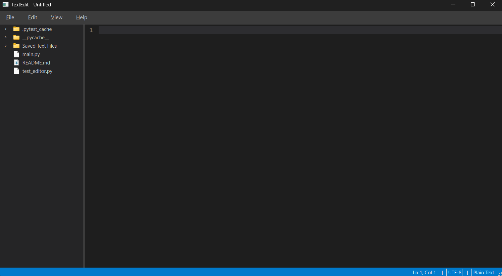

Changes made by Didar Jaff
I added the ability to choose different fonts, font colors, and font sizes in the editor. I also added Multi-language syntax highlighting using static language definitions. You can choose a language of choice and it will automatically highlight it.

R1
I was not in the class for week 1 so I didn't work on the texteditor.

R2
Note the work that these release notes talk about was done in week 3 but it seems like a good breaking point based on the requirements.
First of all, I was very impressed by how much the AI was able to do.  First, in order to get the basic text editor I gave it the assignment instructions excluding the extra features and told it to make a text editor similar to "vs code".  When trying to run it I got an error and I posted it into amp and it fixed it.  And in two prompts I got a super good text editor (super good based on the problems I heard others have in class).  It gave me the basic text editor with a ton of working features.  It had the basic ability to edit and select.  It had a ton of shortcuts, saving and opening files, copying, pasting, undo, redo and more.  It also had a little star at the top that indicated whether the file was saved or not, and when it was not saved and the user tried to exit or go to a different file, it had an unsaved changes warning.  It looked super good as well (see the image below).  It also decided to make a side pannel for files, although it doesn't currenlty have a way to change which folder is being viewed.

It did a lot of things right the first time, but there were still some bugs that were found after spending some time interacting with it.  It implemented find and replace with a small bug.  It is fixed now, but originally Find was case-insensitive, Replace was case-insensitive, but Replace All was case-sensitive.  It also implemented a zoom in and out shortcut that worked for everything except the line numbers and when I used this it was impossible to tell when I was back to the original 100% zoom.  I did also have amp implement a ton of tests, but honestly IDK if this means my text editor is any better or not.  After finding the replace all bug I told amp to write tests for that, but they all passed the first time and they were written as if Replace All was supposed to be case-sensitive (which it wasn't).  I ended up doing a regression test for this and called it good.  There are also several other things that don't work how they are supposed to.  I made a list in another file (./Saved Text Files/Text Editor Issues and Bugs.txt) but it feels to long to put it all here.

R3
The extra features that I implemented were the find and replace, including multi-file find and replace, multi-file support, tabs, and split views, and a file tree explorer with collapsing folders.  Within the first few prompts it gave me part of the find and replace and also the file tree explorer.  The find and replace didn't include multi-file find and replace, and the file tree explorer couldn't change the folder that was being viewed.  These are both fixed now.  I also added functionality for dragging files from the side bar into a view in order to open that file.  Similar to this I added the functionality for draging a tab/file from one view into another.  As I was implementing this text editor I found a lot of bugs, and I listed them in a few text files.  They are in "All Current Problems.txt" and "The Rest.txt".  All the bugs that I identified have been fixed.

Now I am going to explain how my coding experience went.  First, I found that there were two different types of changes that I made and for each of them I took a different approach with the AI.  These types were adding a new feature, and fixing a bug.  For adding a new feature I basically just explained the feature exactly how I wanted it and as detailed as I thought the AI would need.  After the feature was created I would ask the AI to write several tests testing the feature.  I found that when adding a new feature it was almost impossible to avoid a ton of bugs even though the AI wrote tests for it and I was fine with this.  For fixing a bug I used a process that worked super well and almost every single time, the bug would come back fixed.  This process was based on the regression test idea that was talked about in class.  I put "The Bug Fixing Process" in my AGENTS.md so it would use it when ever I explained a new bug.  The process was to write a test that tests the desired functionality, ensure the test fails, fix the bug, and finally ensure the test passes.  I used this process on so many bugs and after the AI was done, the bug would be fixed and there would be a test in place that I knew tested for that exact bug.  A lot of times the AI would write a test, it would pass the first time, then it would realize that it hadn't recreated the bug and didn't understand the bug fully.  So it would investigate it further.  This process worked super good because the AI had to understand the bug before it tried to fix it, and also every time a bug was fixed, a new test would be in place so that bug could never exist again.